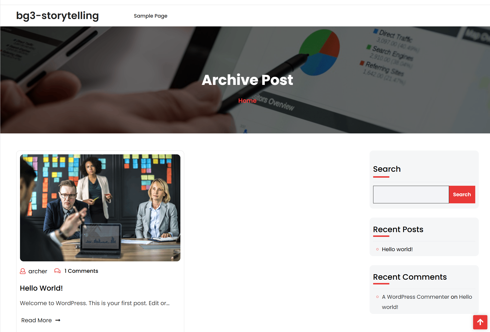
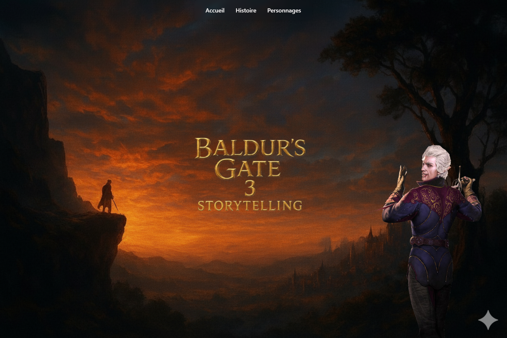
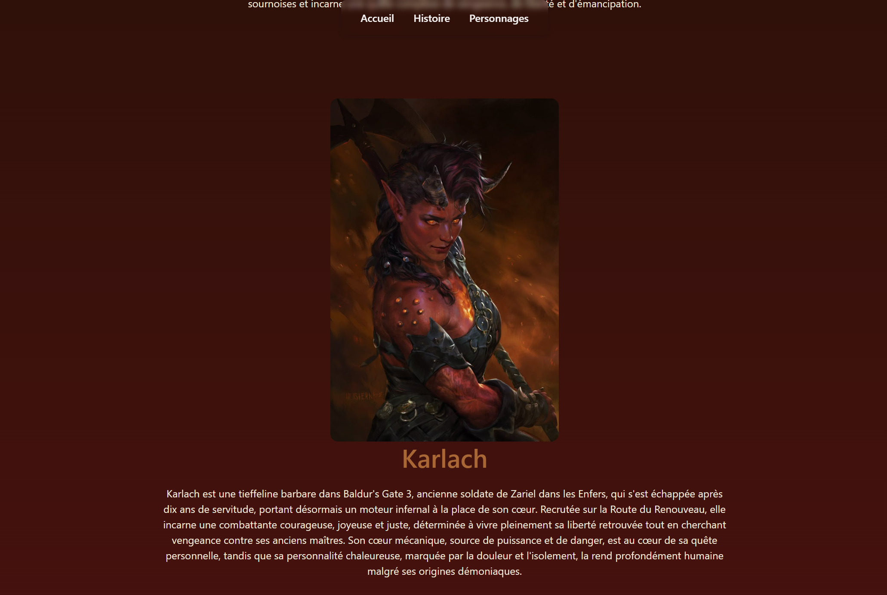

# Child_theme_WordPress_Project 
Bouala Eva

## Thème parent
**Creativ Portfolio Lite**  
Thème WordPress orienté portfolio et storytelling, utilisé ici comme base pour un site narratif inspiré du jeu *Baldur’s Gate 3*.

## Modifications effectuées

### Structure générale
- Création d’un **thème enfant** : `creativ-portfolio-lite-child`.
- Ajout d’un **header personnalisé** (navigation fixe + liens vers les sections principales : Accueil, Histoire, Personnage).
- Création d’un **footer** cohérent avec le style du site.
- Personnalisation complète du **CSS** pour donner un univers sombre et immersif.

### Pages et templates
- Création de plusieurs **templates personnalisés** :  
  - `astarion.php`, `karlach.php`, `gale.php`, `shadowheart.php`, etc.  
    → chaque fichier présente un personnage avec son image, sa biographie et un style unique.
- Ajout d’une page `histoire.php` retraçant les actes du jeu.
- Page d’accueil avec un **hero image animé** (effet de scroll et overlay sombre dynamique).

### Design
- Uniformisation des couleurs.
- Ajout d’une **cohérence visuelle entre les pages personnages** (structure, mise en page responsive, effets de lumière).
- Personnalisation du fond global (fond noir texturé).

## Hooks et templates utilisés

### Hooks WordPress
- `add_action('wp_enqueue_scripts', 'bg3_enqueue_scripts')`  
  → pour charger les fichiers CSS/JS du thème enfant.

- `get_header()` / `get_footer()`  
  → inclus dans chaque template personnalisé.

### Templates personnalisés
- `astarion.php`, `karlach.php`, `gale.php`, `shadowheart.php`, `wyll.php`, `lazael.php`
- `histoire.php`
- `front-page.php` 

### Avant du site :
 --> Si elle ne s'ouvre pas elle se trouve également avec les autres fichiers 

### Après du site :
 --> Même chose
 --> Même chose